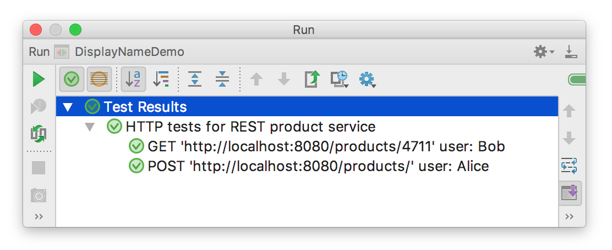

=== Frei definierbare Namen

Die Annotation @DisplayName ermöglicht es, fast beliebige Namen für Testklassen
und einzelnen Testmethoden zu verwenden,
so dass sich übersichtliche und gut lesbare Baumdarstellungen in der GUI der IDE erzielen lassen.

image::images/displayname_code.png[DisplayName, 350, float="left",align="left"]

Dies ergibt in der Ausführung eine saubere Darstellung in der IDE.
Das Besondere an der Realisierung dieses neuen Features ist die Tatsache,
dass die IDE trotzdem noch in der Lage ist,
zwischen der Baumansicht und dem Sourcecode zu navigieren.
Dies wird dadurch ermöglicht, dass die JUnit Platform der IDE die Möglichkeit gibt,
einzelne Tests sauber zu referenzieren ohne reflexiv auf den Methodennamen zuzugreifen.

