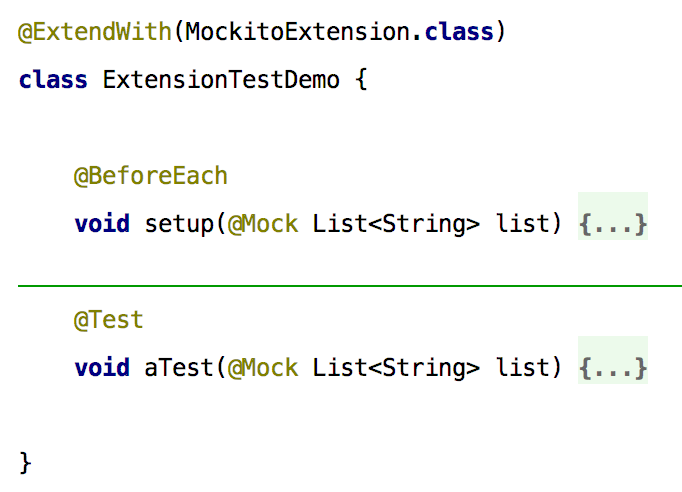

=== Extensions

Im Folgenden soll überblicksartig das neue Extensionmodell vorgestellt werden.
Im Gegensatz zu den zuvor beschriebenen Testengines,
die es ermöglichen, beliebige Testdefinitionen und Ausführungssemantiken zu unterstützen,
dient das im Folgenden beschriebene Extensionmodell zur Verfeinerung der Jupiter-Engine.

Das hybride Erweiterungsmodell von JUnit 4 aus Runner und Rule hatte sich über die Jahre hinweg
insbesondere im Bereich der Komponierbarkeit als problematisch herausgestellt.
Daher wurde bei JUnit 5 viel Energie darauf verwendet,
ein sowohl einheitliches als auch ausdrucksmächtiges Erweiterungsmodell für die Jupiter-Engine zu entwerfen und umzusetzen.
Es handelt sich dabei um ein feingranulares Erweiterungsmodell,
das einen selektiven Eingriff an vielen Stellen der Testdefinition und -ausführung erlaubt.
Insbesondere sind die Erweiterungen aus technischer Sicht beliebig kombinierbar.
Diesem Thema ließe sich leicht ein ganzer Artikel widmen,
hier soll nur kurz an Hand eines Beispiels die Grundidee erläutert werden.

image::images/mockito_extension_diagram.png[]

Als Basis aller Erweiterungen für JUnit Jupiter gibt es das Marker-Interface 'Extension'.
Nehmen wir nun an, dass eine einfache Extension zur Integration des Mockframeworks Mockito erstellt werden soll.
Konkret müsste eine solche 'MockitoExtension' die beiden ExtensionPoints
'TestInstancePostProcessor' und 'ParameterResolver' implementieren,
wenn man die Extension dann wie in Abbildung XXXXX verwenden will.
Beide ExtensionPoints erweitern wiederum das genannte Marker-Interface.

In diesem Beispiel wird der ExtensionPoint 'TestInstancePostProcessor' benötigt,
um über das Mockito-API die Mocks direkt nach Erstellung der Testinstanz zu initialisieren.
Der ExtensionPoint 'ParameterResolver' hingegen dient dazu,
die so erzeugten Mocks elegant in die gewünschten Test- oder Lifecycle-Methoden hineinreichen zu können,
was präzise ausdrücken lässt, für welche Methoden welche Mocks bestimmt sind.

Neben den beiden hier genannten ExtensionPoints gibt es eine ganz Reihe anderer,
etwa zur Handhabung von Ausnahmen und insbesondere zur Interaktion mit den benutzerdefinierten Methoden des Test-Lifecycle
(z.b. @BeforeAll und BeforeAllCallback).
Benötigt man in einer Extension einen Zustand über verschiedene Aufrufe hinweg,
so sollte man diesen im bereitgestellten `ExtensionContext.Store` ablegen,
um Probleme bei der Komposition von Extensions zu vermeiden.

Zusammenfassend lasst sich sagen,
dass man entweder auf einer sehr hohen Granularitätsebene eine eigene Testengine implementieren kann
oder aber die Standard-Testengine 'Jupiter' durch feingranulare und komponierbare Extensions erweitern kann.
Eine Kombination aus eigener Engine und Jupiter-Extensions funktioniert natürlich auch in JUnit 5 nicht.
Dies liegt aber in der Natur der Sache,
da ein Erweiterungsmodell notwendigerweise die Abstraktionen einer konkreten Engine manipulierbar machen muss
und sich nicht sinnvoll über alle denkbaren Engines hinweg verallgemeinern lässt.
