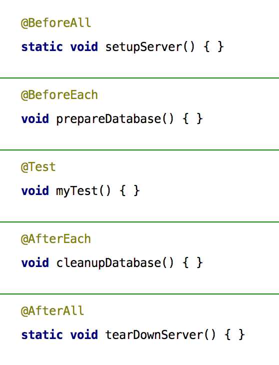

=== Hello TestWorld

Als Einstieg soll zunächst ein bewusst minimalistisches Beispiel dienen,
bevor einige fortgeschrittene oder grundsätzlich neue Feature vorgestellt werden.
Naheliegenderweise heißt die wichtigste Annotation immer noch @Test.
Im Unterschied zu JUnit 4 muss man allerdings ein anderes Package importieren:
'org.junit.jupiter.api' anstelle von 'org.junit'.
Hierbei bezeichnet 'jupiter' die Testengine,
die das neue JUnit 5-Programmiermodell unterstützt.
Wie im Abschnitt über die Architektur weiter ausgeführt
unterstützt die neue JUnit-Plattform die Koexistenz verschiedener Testengines.

Man erkennt sogleich,
dass sich die Namen der Lifecycle-Methoden im Vergleich zu JUnit 4 geändert haben.
Die neue Nomenklatur ist das Ergebnis langer Diskussionen [3] und versucht,
die Bedeutung noch deutlicher hervorzuheben, als das bisher der Fall war.
Zu den wichtigsten Annotationen gehören die Folgenden:
@BeforeAll wird einmal pro Testklasse aufgerufen, @BeforeEach vor jeder einzelnen Testmethode;
analoges gilt für die After-Methoden.
Erwähnenswert ist ebenfalls, dass der Modifier `public` entfallen kann.
