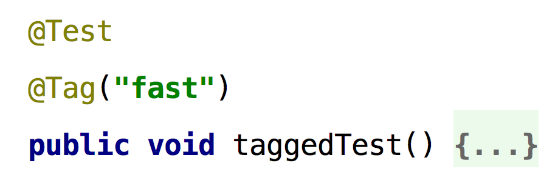

=== Tags und Meta-Annotations

Eine weitere Veränderung im Vergleich zu JUnit 4 ist das Tagging von Tests mit bestimmten Labeln,
was in JUnit 5 String-basiert und nicht mehr über den klassen-basierten Category-Mechanismus gelöst ist.

Möchte man nun für eine Menge von Tests (z.B. für alle Integrationstests) ein solches Tag vergeben,
so kann es sinnvoll sein, sich eines neu eingeführten Mechanismus' zu bedienen.
So wird nämlich für alle im Jupiter-API vorhandenen Annotationen eine Komposition von Annotationen zu Meta-Annotationen unterstützt.
Ähnliche Mechanismen sind wieder aus dem Spring Framework oder auch aus der Programmiersprache Groovy bekannt.

Im Beispiel werden besonders schnell ausführbare Tests durch die Meta-Annotation @FastTest gekennzeichnet,
z.B. weil man sie aus Fast-Feedback-Gründen im Build zuerst ausführen möchte.
Mit diesem Mechanismus lassen sich Möglichkeiten der Jupiter-API parametrisieren und zu höherwertigen Abstraktionen zusammenfassen,
was der konsistenten Verwendung z.B. durch verschiedene Testautoren im Team dienen kann.

