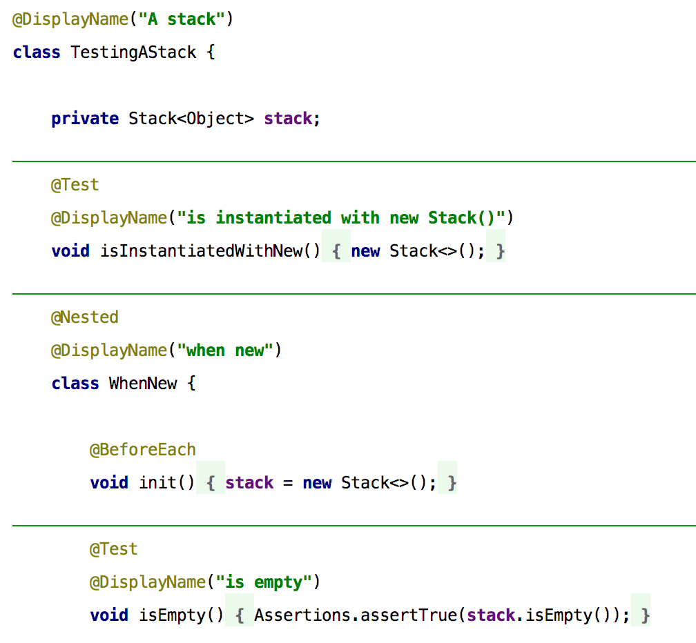
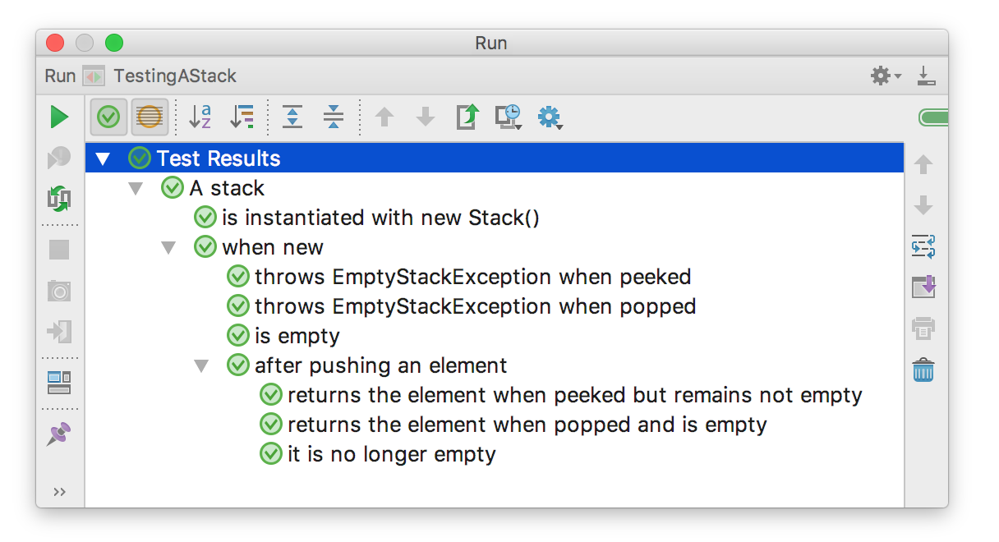

=== Nested Tests

JUnit Jupiter unterstützt direkt die Erstellung von geschachtelten Tests über die Annotation @Nested.
Diese Fähigkeit ist grob vergleichbar mit dem aus JUnit 4 bekannten HierarchicalContextRunner.

.Nested Tests

Auch hier führt die Ausführung zu einem visuell besonders ansprechenden Ergebnis in der IDE,
das in gewisser Weise schon an die spezifikationsnahen Darstellungen aus BDD-Frameworks erinnert.

.Ausführung von Nested Tests in der IDE

