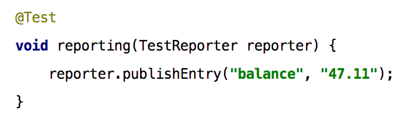

=== Parameter Injection und Test-Reporting

Eine weitere Neuerung,
die vor allem aus dem Spring Framework und anderen Dependency-Injection-Mechanismen bekannt ist,
ist die Möglichkeit zur Parameter-Injection.

Durften Testmethoden in den bisherigen Versionen von JUnit keine Argumente haben,
so fällt diese Einschränkung mit JUnit Jupiter weg.
Dieser neue Mechanismus ermöglicht es Erweiterungen,
Parameter für die Ausführung einer Testmethode bereit zu stellen.
Dazu können solche ParameterResolver-Extensions registriert werden,
um Parameter aufzulösen, z.B. basierend auf einem bestimmten Typen oder einer bestimmten Annotation.
Im angegebenen Beispiel wird der bereits mitgelieferte typbasierte 'TestReporterParameterResolver' aktiv,
um eine TestReporter-Instanz zu liefern.
Mit diesem TestReporter können unabhängig von der Konsole in geordneter Weise Informationen an die ausführende Umgebung geliefert werden.

