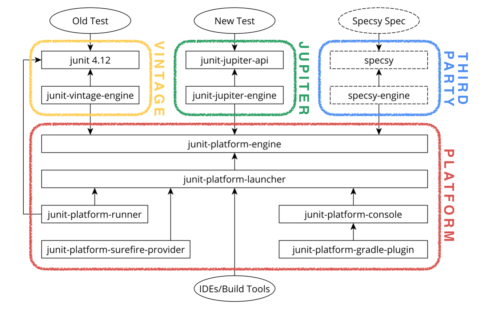

== Architektur: Platform, Testengines und Extensions

== JUnit 5 = JUnit Platform + JUnit Jupiter + JUnit Vintage

Eines der Hauptziele bei der Neuentwicklung von JUnit 5 war die
Entkopplung der APIs zum Schreiben von denen zum Ausführen von Tests.
In JUnit 4 sind beide APIs in einem Artefakt enthalten.
Alle, die JUnit auf irgendeine Weise verwenden, hängen von diesem einzigen jar-File ab,
unabhängig davon, ob es sich dabei um IDEs, Build Tools, andere Test-Frameworks oder Testautoren handelt.
Diese Verwender benutzen teilweise Interna von JUnit,
etwa interne Klassen oder private Instanzvariablen.
So scheiterte z.B. der Versuch,
die Version 4.12-beta-1 in Kombination mit einer bekannten IDE zu betreiben,
weil die IDE eine private Variable, die umbenannt worden war, per Reflection referenziert hatte.
Diese Art der Integration war der Tatsache geschuldet,
dass es eben kein explizites API für die Integration in Tools gab.
Die Weiterentwicklung von JUnit 4 wurde dadurch immens erschwert,
in Teilen sogar nahezu unmöglich gemacht.

.Gesamtarchitektur von JUnit 5

Wie das oben abgebildete Architekturdiagramm zeigt,
wurde beim Entwurf von JUnit 5 großer Wert darauf gelegt,
eine möglichst saubere Trennung der APIs für die unterschiedlichen Rollen der möglichen Verwender zu erreichen.
So benötigt ein Testautor lediglich die Dependency _junit-jupiter-api_,
die alle Annotations wie etwa `@Test`, Lifecycle-Annotationen und grundlegende Assertions mitbringt.

Tools, die eine JUnit 5-Integration anbieten wollen,
wie etwa IDEs oder Build Tools verwenden das Modul _junit-platform-launcher_ innerhalb der JUnit 5-Plattform,
um die Ausführung von Tests anzustoßen.
Der darin enthaltene _Launcher_ orchestriert das Auffinden
und die Ausführung von Tests durch verschiedene _Engines_.

Die Engine-Abstraktion ermöglicht die Ausführung von Testfällen auf Basis von JUnit 4 und JUnit 5 innerhalb eines einzigen Testlaufs.
Dies impliziert, dass man bei existierenden Projekten auf Basis von JUnit 4 langsam mit einigen JUnit 5-Tests beginnen kann
und keineswegs gezwungen ist, eine Big-Bang-Migration durchzuführen.
Weitere Hilfen für die Migration finden sich im Artefakt 'junit-jupiter-migrationsupport'.
Um von einem integrierenden Tool angesprochen zu werden,
müssen Test-Engines lediglich auf dem Klassenpfad vorhanden sein
und sich über den normalen _ServiceLoader_-Mechanismus der JVM beim Launcher registrieren.

Die Engine-Implementierungen hängen dabei nur vom Artefakt _junit-platform-engine_ ab.
JUnit 5 liefert zwei Engines aus:
Die _junit-vintage-engine_ dient dem Auffinden und der Ausführung von JUnit 4-Tests.
Die _junit-jupiter-engine_ hingegen implementiert das neue Programmiermodell von JUnit 5.
Die Engine API ist dabei im Prinzip ein Angebot an existierende und zukünftige Test-Frameworks.
Solche Frameworks müssen nur eine Engine-Implementierung bereitstellen,
und profitieren sofort von der Integration,
die die Tool-Hersteller für die JUnit 5-Plattform einmalig erstellt haben.
Da eine Engine-Implementierung in vielen Fällen recht einfach zu erstellen ist
[  Referenz vortrag jax 17],
sinkt somit die Schwelle,
ein sauber integriertes Test-Framework einem weiteren Benutzerkreis zur Verfügung zu stellen.

Zusammenfassend lässt sich sagen,
dass das neue JUnit 5 erstmalig eine Plattform-Abstraktion zur Integration bereitstellt,
die sauber von Test-Engines getrennt ist,
die ihrerseits ein bestimmtes Programmiermodell für Tests unterstützen.
Die JUnit-Jupiter-Engine realisiert dabei das neue JUnit 5-Programmiermodell,
die JUnit-Vintage-Engine wird aus Gründen der Abwärtskompatibilität und Migrationsunterstützung mitgeliefert.
Alle Beispiele und neuen Features in diesem Artikel beziehen sich auf die neue JUnit-Jupiter-Engine.

