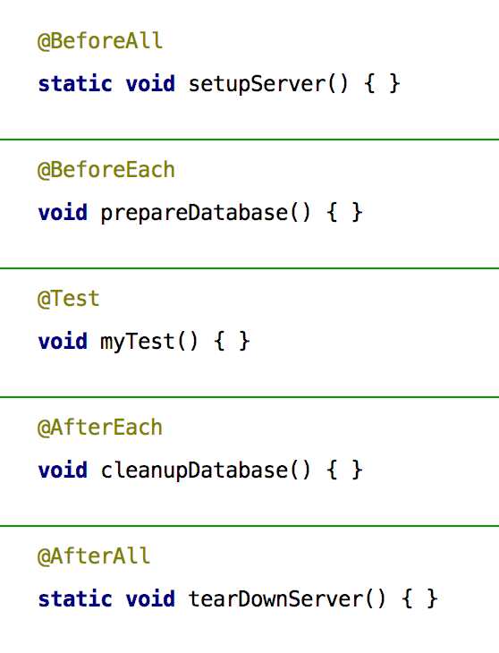

== Hintergrund und Motivation

Das Test-Framework JUnit hat seit dem ersten Release von Erich Gamma und Kent Beck wesentlich dazu beigetragen,
testgetriebene Entwicklung zu ermöglichen.

Nach vielen Jahren ohne neues Major Release und ohne grundlegende Modernisierungsmöglichkeit
hat im Oktober 2015 die Entwicklung der vollständig überarbeiteten Version 5 begonnen.
Nach einer Startfinanzierung durch die Crowdfunding-Kampagne "JUnit Lambda" und einer Reihe von Milestone-Releases
ist die Version 5.0 noch für 2017 geplant.

Das Test-Framework JUnit wurde ursprünglich im Jahr 2000 in der ersten Version veröffentlicht,
von Kent Beck und Erich Gamma der Legende nach im Flugzeug per Pair-Programming entwickelt [1].
JUnit war Vorbild für viele andere Test-Frameworks und wurde auf zahlreiche andere Plattformen portiert.
Nach einer aktuellen Untersuchung vom Juli diesen Jahres [2] ist JUnit die am meisten verwendete Java-Bibliothek überhaupt.

Nach vielen Jahren der Weiterentwicklung und Wartung ist JUnit mittlerweile bei Version 4.12 angelangt.
Im Lauf dieser Wartungsarbeiten zeigte sich, dass es an der Zeit war, über die fünfte Generation von JUnit nachzudenken.
Zum einen, weil die vorherigen Versionen naturgemäß keine Sprachfeatures von Java 8 unterstützen konnten,
zum anderen, weil die zur Verfügung stehenden Konstrukte die Komponierbarkeit von Erweiterungen erschwerten.
Nicht zuletzt ist die Art und Weise, in der IDEs JUnit integrieren, hinderlich für die Weiterentwicklung.

Da es sich bei dieser Neukonzeption um ein größeres Unterfangen handelt,
wurde zur Mitfinanzierung des JUnit-Lambda-Projekts eine Crowdfunding-Kampagne ins Leben gerufen [3].
Hierbei konnte mehr als das Doppelte des ursprünglich anvisierten Minimalbudgets erlöst werden.
Insbesondere zeigt aber die hohe Zahl von 474 Unterstützern das große Interesse der Community an der Vision des JUnit-Lambda-Projektes.
Neben 428 privaten Personen haben 36 Unternehmen, darunter große Anwender,
insbesondere aber auch Hersteller von Entwicklungswerkzeugen, ihren Anteil zur Unterstützung beigetragen.
Mit diesem Rückhalt fand im Oktober 2015 das Kickoff-Treffen in Karlsruhe statt,
bei dem die Anforderungen bezüglich Integrierbarkeit mit den Herstellern
von Gradle, Eclipse und IntelliJ IDEA und sowie mit Pivotal, dem Hersteller des Spring Framework, diskutiert wurden.

Im Folgenden werden wir einen ersten Überblick über
die neue Gesamtarchitektur,
das Programmiermodell und das zugehörige API,
sowie die Themen Erweiterbarkeit und Integrierbarkeit geben.

== Hello TestWorld

Als Einstieg soll ein bewusst minimalistisches Beispiel dienen.
Naheliegenderweise heißt die wichtigste Annotation immer noch @Test.
Im Unterschied zu JUnit 4 muss man allerdings ein anderes Package importieren:
'org.junit.jupiter.api' anstelle von 'org.junit'.
Hierbei bezeichnet 'jupiter' die Testengine,
die das neue JUnit 5-Programmiermodell unterstützt.
Wie im Abschnitt über die Architektur weiter ausgeführt
unterstütz die neue JUnit-Plattform die Koexistenz verschiedener Testengines.

Auch wenn man von den import-Statements absieht, erkennt man gleich,
dass sich die Namen der anderen Lifecycle-Methoden im Vergleich zu JUnit 4 geändert haben.
Die neue Nomenklatur ist das Ergebnis langer Diskussionen und versucht,
die Bedeutung noch deutlicher hervorzuheben, als das bisher der Fall war.
Im Einzelnen werden folgende Annotationen unterstützt:
@BeforeAll wird einmal pro Testklasse aufgerufen, @BeforeEach vor jeder einzelnen Testmethode;
analoges gilt für die After-Methoden.

