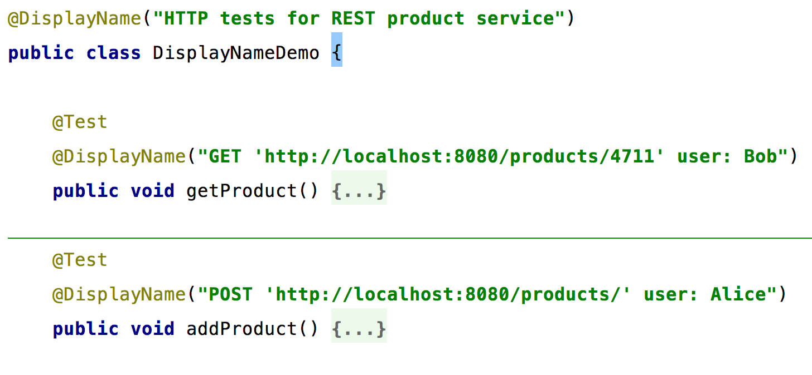
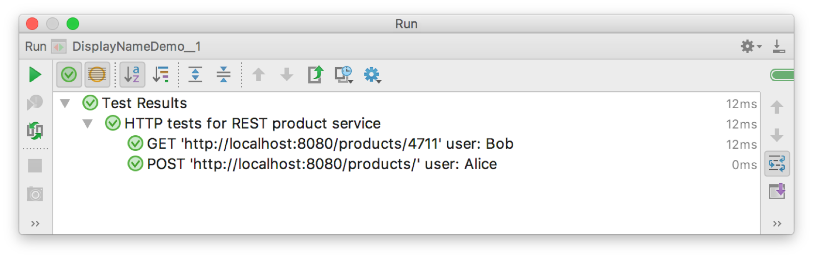
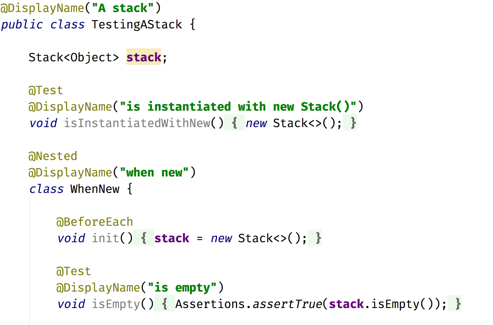
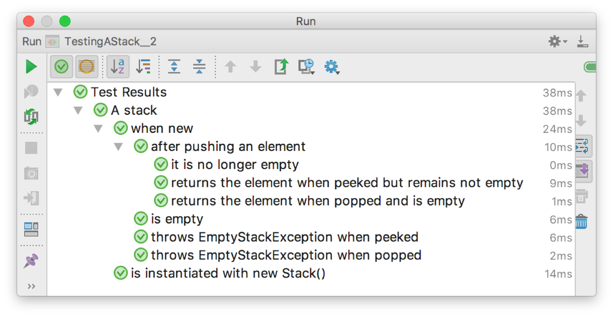
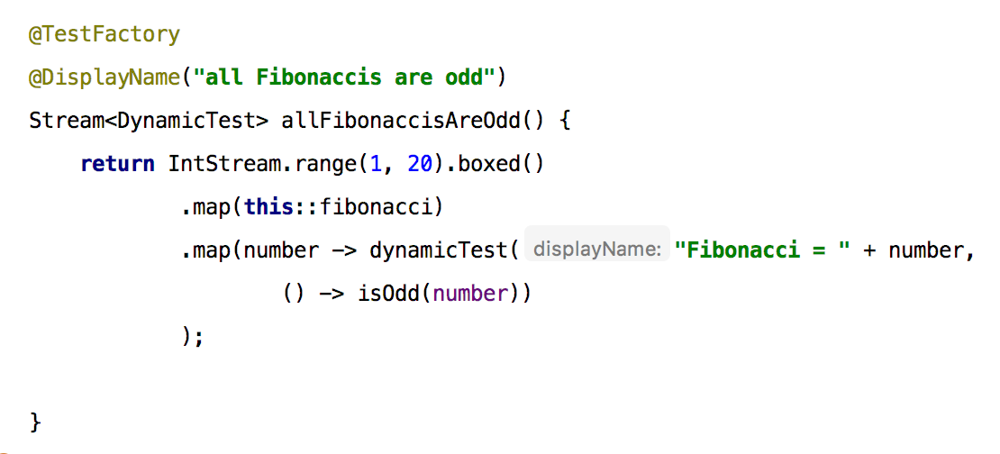
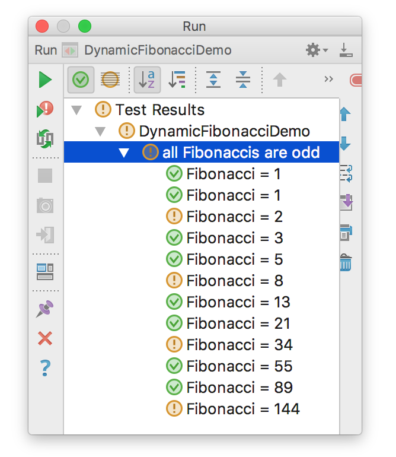
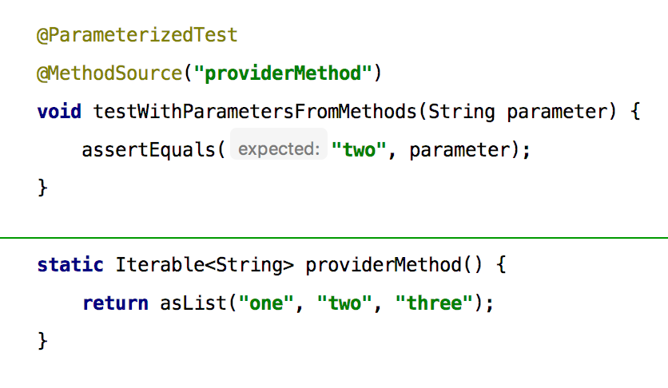
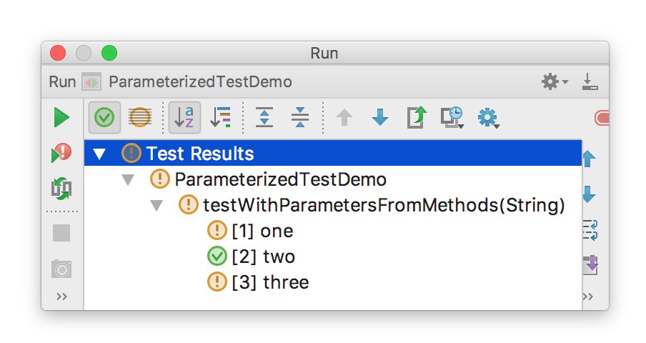
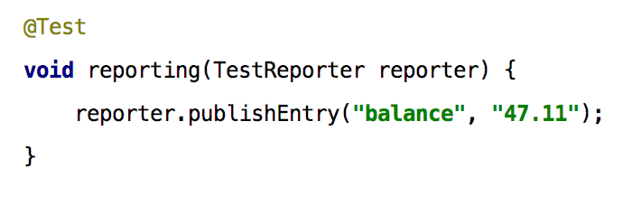

== Wesentliche Neuerungen

=== Frei definierbare Namen

Die Annotation @DisplayName ermöglicht es, fast beliebige Namen für Testklassen
und einzelnen Testmethoden zu verwenden,
so dass sich übersichtliche und gut lesbare Baumdarstellungen in der GUi der IDE erzielen lassen.

Dies ergibt in der Ausführung eine saubere Darstellung in der IDE.
Das Besondere an der Realisierung dieses neuen Features ist die Tatsache,
dass die IDE trotzdem noch in der Lage ist,
zwischen der Baumansicht und dem Sourcecode zu navigieren.
Dies wird dadurch ermöglicht, dass die JUnit Platform der IDE die Möglichkeit gibt,
einzelne Tests sauber zu referenzieren ohne reflexiv auf den Methodennamen zuzugreifen.

=== Nested Tests

JUnit Jupiter unterstützt direkt die Erstellung von geschachtelten Tests über die Annotation @Nested.
Diese Fähigkeit ist grob vergleichbar mit dem aus JUnit 4 bekannten HierarchicalContextRunner.

Auch hier führt die Ausführung zu einem visuell besonders ansprechenden Ergebnis in der IDE,
das in gewisser Weise schon an die spezifikationsnahen Darstellungen aus BDD-Frameworks erinnert.

=== Dynamische Tests: @TestFactory und @ParameterizedTest

Während die grundlegenden Annotationen wie @Test oder @BeforeEach, @AfterAll etc im wesentlichen
eine vergleichbare Semantik wie die entsprechenden JUnit 4-Vorgänger haben,
so gibt es in JUnit 5 auch grundlegend neue Konzepte.
Hierzu zählt insbesondere die Möglichkeit, dynamische Tests zu erstellen.

Neben den schon aus JUnit 4 in verschiedenen Varianten bekannten parametrisierten Tests
stellen vor allem die Annotation @TestFactory eine besondere Neuerung dar.
Mit dieser Annotation gekennzeichnete Methoden stellen selbst keine Tests dar,
sondern liefern eine Stream (oder eine Collection) an Testfällen zurück.
Dieser Stream entsteht erst zur Laufzeit,
insbesondere ist seine Länge nicht vorab bekannt.
Durch die in der JUnit Platform exponierten Listener ist die IDE aber dennoch in der Lage,
für jeden Testfall innerhalb des Streams einen sauberen Knoten im Ausführungsbaum darzustellen
und das in Verbindung mit dynamischen Namen.
Lässt man z.B. das folgende Beispiel in einer IDE ablaufen,
so sieht man, dass die einzelnen Knoten tatsächlich erst zur Laufzeit
bei der Durchführung des gerade entstandenen Tests zur graphischen Darstellung hinzugefügt werden.

Im Beispiel geht man von einem Stream natürlicher Zahl aus
und bildet diesen mit Hilfe der Methodenreferenz 'fibonacci' auf Fibonacci-Zahlen ab.
Diese Fibonacci-Folge wird dann über
org.junit.jupiter.api.DynamicTest.dynamicTest(String displayName, Executable executable)
auf einen Stream von dynamischen Testfällen abgebildet.
Auch wenn in diesem Beispiel bereits zum Zeitpunkt der Testerstellung
die Folge auf 12 Testfälle begrenzt wird,
so könnte man jederzeit ein erst zur Laufzeit berechnetes Abbruchkriterium verwenden.

Eine solche Funktionalität lässt sich mit Hilfe von Lambda-Ausdrücken elegant realisieren.
Die so gewonnene Ausdrucksmächtigkeit für dieses und andere Feature
war bei den Vorüberlegungen für das neue JUnit 5 im Jahre 2015 mit ausschlaggebend dafür,
die Abwärtskompatibilität zu Java 5 fallen zu lassen.
Nicht umsonst trug die zur Anschubfinanzierung der Neuentwicklung initiierte Crowdfunding-Kampagne
den Namen JUnit Lambda.

Erwähnenswert ist in diesem Zusammenhang,
dass es für diese Art von dynamischen Tests explizit _keine_ Ausführung von Lifecycle-Methoden auf der Ebene
einzelner Testfälle gibt, sondern nur für die ganze @TestFactory-Methode.
Möchte man also,
dass z.B. @BeforeEach-Methoden für jeden einzelnen einer Menge von Testfällen aufgerufen werden,
so sollte man die Annotation @ParameterizedTest verwenden.
Dies Art von Test bietet weiter den Vorteil, dass die Werte, die einzelnen Testfälle parametrisieren,
aus diversen vorhandenen oder selbst implementierbaren Quellen bezogen werden können.
Im Gegensatz dazu werden diese Werte bei den zuvor behandelten dynamischen Tests typischerweise direkt im Code berechnet.
Im folgenden Beispiel werden die Parameter der Einfachheit halber mit Hilfe der Annotation @MethodSource aus einer lokalen Methode gelesen.

Zusammenfassend lässt sich sagen, dass beide Varianten es ermöglichen, eine Gruppe von Testfällen zu erzeugen,
deren Anzahl zuvor nicht bekannt ist.
Die Auswahl einer Variante kann dadurch geleitet werden,
ob man Lifecycle-Support auf Testfall-Ebene benötigt
und ob die parametrisierenden Werte sich im Test leicht berechnen lassen oder aus externen Quellen bezogen werden müssen.

=== Parameter Injection und Test-Reporting

Eine weitere Neuerung,
die vor allem aus dem Spring Framework und anderen Dependency-Injection-Mechanismen bekannt ist,
ist die Möglichkeit zur Parameter-Injection.

Durften Testmethoden in den bisherigen Versionen von JUnit keine Argumente haben,
so fällt diese Einschränkung mit JUnit Jupiter weg.
Dieser neue Mechanismus ermöglicht es Erweiterungen,
Parameter für die Ausführung einer Testmethode bereit zu stellen.
Dazu können solche ParameterResolver-Extensions registriert werden,
um Parameter aufzulösen, z.B. basierend auf einem bestimmten Typen oder einer bestimmten Annotation.
Im angegebenen Beispiel wird der bereits mitgelieferte typbasierte 'TestReporterParameterResolver' aktiv,
um eine TestReporter-Instanz zu liefern.
Mit diesem TestReporter können unabhängig von der Konsole in geordneter Weise Informationen an die ausführende Umgebung geliefert werden.

=== Tags und Meta-Annotations

123

=== Extensions

567

Aus Platzgründen verzichten wir hier auf die Vorstellung kleiner neuer Features
wie Unterstützung für Exception-Testing oder gruppierte Assertions.
Diese und viele weitere Details lassen sich im sehr ausführlichen User Guide nachlesen
[REF: http://junit.org/junit5/docs/current/user-guide/].