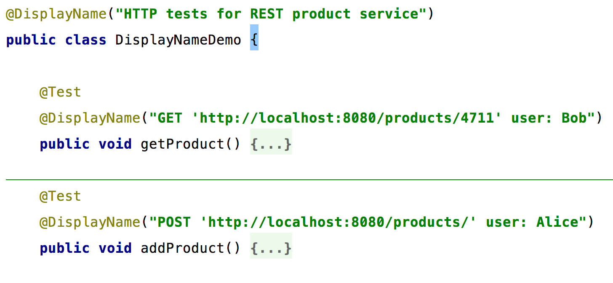

=== Frei definierbare Namen

Dies ergibt in der Ausführung eine saubere darstellung in der IDE.
Das Besondere an dieser neuen Möglichkeit, beliebige Namen zu vergeben,
ist die Tatsache,
dass die IDE trotzdem noch in der Lage ist zwischen der Baumansicht und dem Sourcecode zu navigieren.
Dies wird dadurch ermöglicht, dass die JUnit Platform der IDE die Möglichkeit gibt,
einzelne Tests sauber zu referenzieren ohne reflexiv auf den Methodennamen zuzugreifen

image::images/displaynames_ide.png[]

=== Nested Tests
=== Dynamische Tests: @TestFactory und @ParameterizedTest

